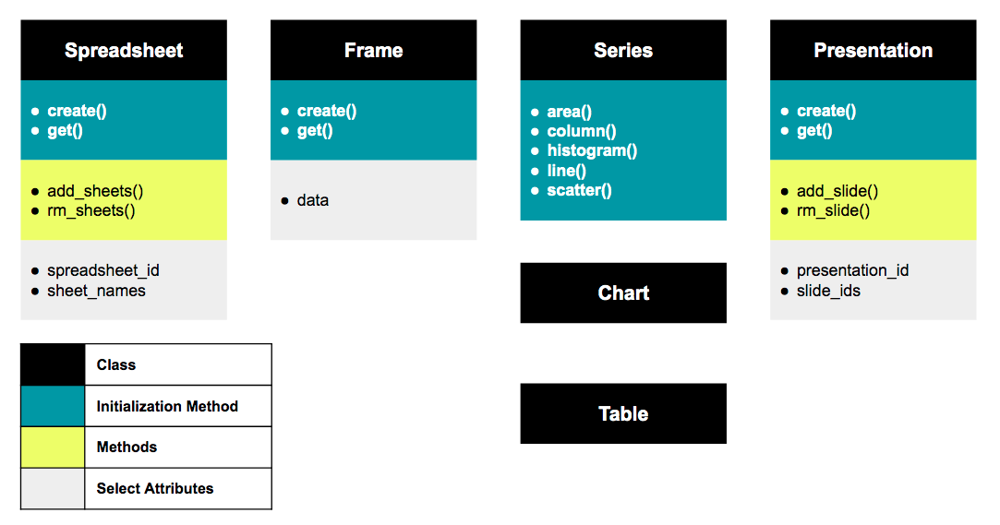

Basic Usage
=========================================

The following page will provide an understanding around the class structure for ``gslides``. To accompany this documentation, see an example of the usage of ``gslides`` in this `notebook <https://github.com/michael-gracie/gslides/blob/poc/notebooks/usage.ipynb>`_.

Data Flow
----------------------------------------

Taking an object oriented approach, ``gslides`` provides classes that represent objects in either Google sheets or Google slides to enable the user flexibility in terms of how there are creating their pipeline and executing their dependencies.

The diagram below shows how data flows through the pipeline.

The modularization of the pipeline allows the user to create new spreadsheets, sheets and presentations or simply use existing sheets and presentations. Additionally, if the user wants to only use a portion of the pipeline they can choose so.

User supplied ID's
------------------------------------------

From existing spreadsheets and presentations it is possible to retrieve ``spreadsheet_id``, ``sheet_id``, ``presentation_id`` through simply looking at a URL.

.. image:: img/user_id.png

Executing classes
------------------------------------------

Each class, except the ``series`` class, have their own ``execute()`` method. The ``execute`` method will call the Google API to complete a given action. The attributes that are generated by Google through the ``execute`` method are ``spreadsheet_id``, ``sheet_id`` and ``presentation_id``. These parameters and ``data`` cannot be passed to other objects unless the ``execute`` method has ran.

Passing ``Chart`` objects to ``CreateSlide``
^^^^^^^^^^^^^^^^^^^^^^^^^^^^^^^^^^^^^^^^^^^^^

The ``Chart`` class is unique in the fact that it doesn't need to be executed to be passed to the ``CreateSlide`` object. The layout and slide margin parameters set in the ``CreateSlide`` class will optimize the size of the ``Chart`` objects that are to be created. For this reason, the ``execute`` method of ``CreateSlide`` both execute the chart creation in Google sheets, the creation of the slide and the copy of those charts.

.. note::
   There is no restriction on utilizing the ``execute`` method of the ``Chart`` class. It will simply create a chart in Google sheets without optimizing the sizing of that chart for it's destination slide.
